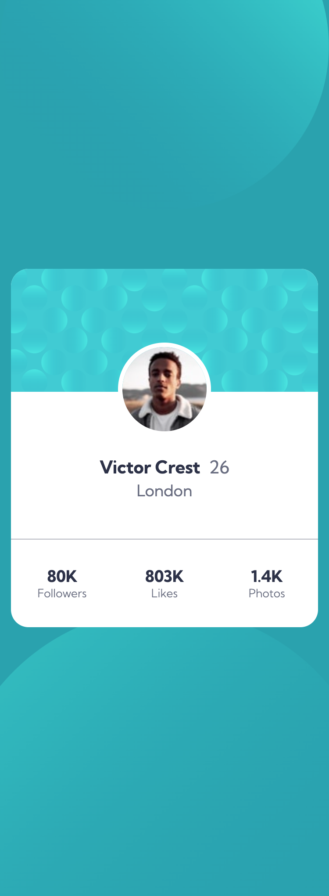
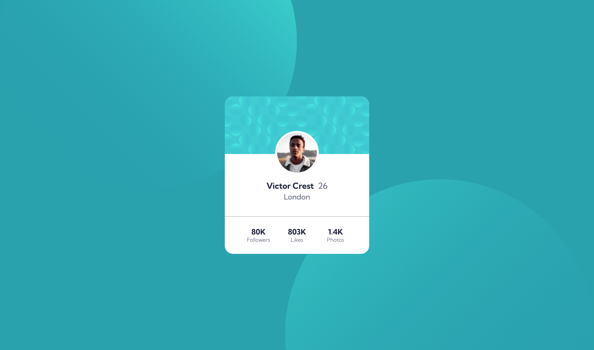

# Frontend Mentor - Profile card component solution

This is a solution to the [Profile card component challenge on Frontend Mentor](https://www.frontendmentor.io/challenges/profile-card-component-cfArpWshJ). Frontend Mentor challenges help you improve your coding skills by building realistic projects.

## Table of contents

- [Overview](#overview)
  - [The challenge](#the-challenge)
  - [Screenshot](#screenshot)
  - [Links](#links)
- [My process](#my-process)
  - [Built with](#built-with)
  - [What I learned](#what-i-learned)
  - [Continued development](#continued-development)
- [Author](#author)

## Overview

### The challenge

- Build out the project to the designs provided

### Screenshot




### Links

- Solution URL: [GitHub](https://github.com/laurellx/FEM-profile-card-component-main)
- Live Site URL: [Vercel](https://fem-profile-card-component-main-eta.vercel.app/)

## My process

The first step I take when working on all FEM project is to break down the elements of the design in order to create the HTML base of the page. After this, I styled this project starting from the mobile version. I noticed that getting the background images to sit in the proper position was taking me some time, therefore I focused on the card's CSS first. I used SASS and Flexbox and revised the position property and its values, as I needed it for the positioning of the avatar image.

### Built with

- Semantic HTML5 markup
- CSS custom properties
- SASS
- Flexbox
- Mobile-first workflow

### What I learned and revised

I took this project as an opportunity to review the CSS postion property, which I applied to the avatar image and his parent element in order to have the first one inserted within the second:

```css
header {
  position: relative;
}
img {
  position: absolute;
}
```

I had some trouble with the styling of the background as well. Two were the provided images and I have not worked with another project that involved multiple svg images.

```css
body {
  background-color: hsl(185, 75%, 39%);
  background-image: url(/images/bg-pattern-top.svg),
    url(/images/bg-pattern-bottom.svg);
  background-size: 100%, 130%;
  background-repeat: no-repeat, repeat-x;
  background-position: top left, bottom;
  background-position-y: -21%, 130%;
}
```

### Continued development

In the future I would like to investigate on svg images and how to properly use them.

## Author

- GitHub - [@laurellx](https://github.com/laurellx)
- Frontend Mentor - [@laurellx](https://www.frontendmentor.io/profile/laurellx)
